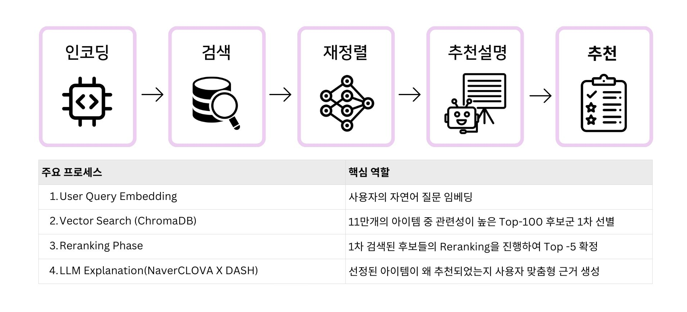
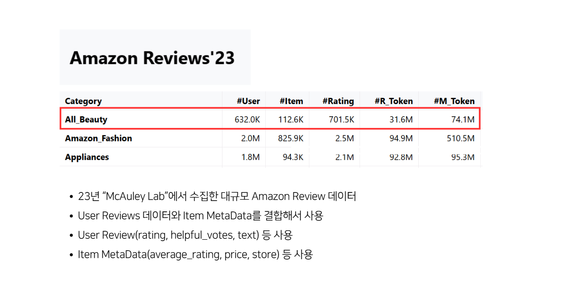
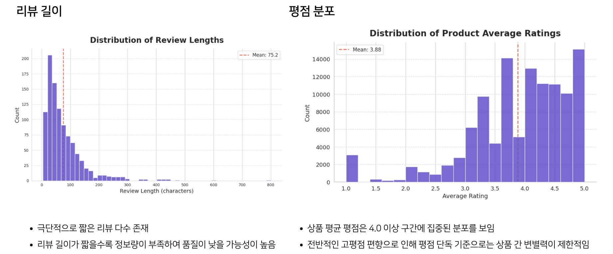
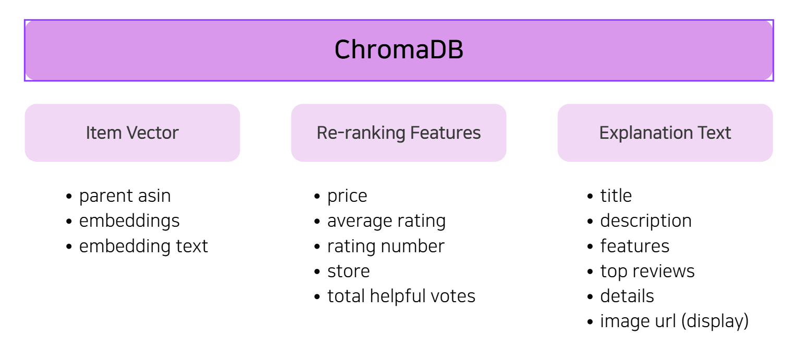
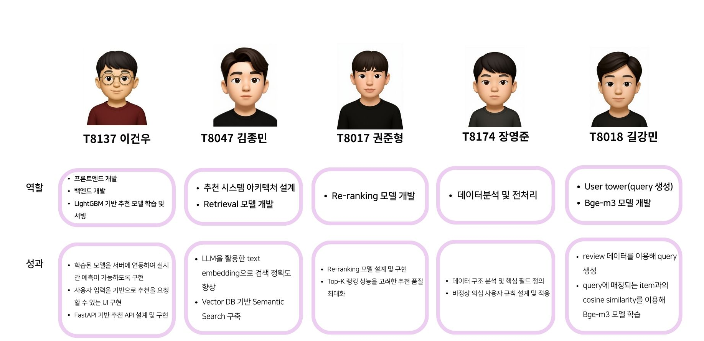

# 💄 ChatBeauty - LLM & RAG-based Amazon Beauty Product Recommendation System

ChatBeauty is a service that recommends **personalized cosmetics based on the user's skin type, concerns, and preferences, along with explanations for each recommendation.**

> "Which cosmetics are right for me?"
> "Are the ingredients safe?"
> "There are so many options — how do I choose?"

Built to solve these common dilemmas.

---

## 🎥 Demo


👉 [Demo Video (YouTube)](https://youtu.be/g0UO8cHWX9I)

---

## 📌 Project Overview

### 🔹 What is ChatBeauty?

ChatBeauty is an AI recommendation system that suggests the most suitable cosmetics based on natural language queries and skin information.

Rather than simply recommending popular products, the core goal is to explain:

- Why this product suits you
- Which ingredients are beneficial

### 🔹 Expected Impact

- Reflects user **skin type, concerns, and preferences**
- Recommendations based on large-scale cosmetics data
- **Explainable recommendations**
- Reduces uncertainty in product selection

> Not "best-selling products,"
> but **"the right products for you."**

---

## 🏗 Service Pipeline

The pipeline consists of 3 stages from user scenario input to recommendation results.

1. **Retrieval**: Encode user scenario with fine-tuned BGE-M3, extract Top-100 candidates from ChromaDB via cosine similarity
2. **Re-ranking**: Use LightGBM (LambdaRank) with metadata features (price, rating, review count, etc.) to select Top-5
3. **Explanation**: HyperCLOVA X DASH-002 generates personalized recommendation reasons based on the user's scenario and actual review data



---

## 📊 Data

### 🔹 Data Source

- **Amazon Reviews 2023 (All_Beauty)**
- 632k users / 112k items / 701k ratings
- Source: https://amazon-reviews-2023.github.io/

### 🔹 Data Structure



### 🔹 EDA



### 🔹 Data Preprocessing

**Problem**: Ensuring reliability of user review data

**Solution**:
- Excessive reviews relative to activity time: users who wrote 10+ reviews within 1 hour
- Rating variance-based: users with 5+ reviews who gave identical ratings for all

→ Users meeting any of the above criteria were classified as suspected abnormal users → ~0.3% of user data removed

### 🔹 Database Schema



---

## 🤖 Recommendation Model

### 🔹 Architecture

ChatBeauty uses a Two-Tower architecture.

- **Query Tower**: User scenario text → Fine-tuned BGE-M3 → 1024-dim vector
- **Item Tower**: Title + review keywords + description summary + features → Fine-tuned BGE-M3 → stored in ChromaDB
- **Fine-tuning**: MultipleNegativesRankingLoss, two approaches (review text-based / LLM-generated query-based)


### 🔹 Candidate Generation (Retrieval)

**Item Tower**: Combines 4 text fields into `embedding_text`
- `[Title]` Product name
- `[Review Keywords]` Keywords extracted from reviews via Llama 3.1 (WHO/WHEN/WHY)
- `[Description Summary]` Product description summarized by Llama 3.1
- `[Features]` Product features

**User Tower**: Trained using review text as queries; at inference, encodes the user's natural language scenario as the query

**Fine-tuning Approach A — Review-based (adopted)**

Raw review text as query, item's `embedding_text` as positive

| Item | Value |
|------|-------|
| Loss | MultipleNegativesRankingLoss |
| Training Pairs | ~1M |
| Epochs | 2 |
| Batch Size | 32 |
| Embedding Dim | 1024 |
| **Valid Recall@100** | 0.2015 → **0.3543** |
| **Test Recall@100** | **0.3728** |

**Fine-tuning Approach B — Generated Query (experimental)**

Natural language queries generated from reviews via Llama 3.1 (excluded: negative reviews + rating < 4.0 + rating_number < 20)

| Item | Value |
|------|-------|
| Training Pairs | ~100K |
| Batch Size | 16 |
| **Valid Recall@100** | 0.0543 → **0.1092** |
| **Test Recall@100** | **0.1587** |

### 🔹 Re-ranking

1-stage retrieval alone lacks purchase-oriented ranking, so a 2-stage structure was applied for refined re-ranking of candidates.

**Model**: LightGBM (leaf-wise approach focuses on top-rank patterns → better suited for NDCG@5)

**Features** (6):

| Feature | Description |
|---------|-------------|
| `cosine_similarity` | User-Item semantic similarity |
| `price` | Price |
| `rating_number` | Number of reviews |
| `average_rating` | Average rating |
| `store` | Store/brand |
| `total_helpful_votes` | Review helpfulness |

### 🔹 Recommendation Explanation

For the final Top-5 products, **HyperCLOVA X DASH-002** generates personalized recommendation reasons based on the user's input scenario and item metadata (features, details, top_reviews).

---

## 🚀 Quick Start

### Setup

```bash
# Install backend dependencies
cd backend
pip install -r requirements.txt

# Install frontend dependencies
cd ../frontend
npm install
```

### Run Servers

```bash
# Run Frontend (React) + Backend (FastAPI) simultaneously
./dev.sh
# Frontend: http://localhost:5173
# Backend:  http://localhost:8000 (API docs: /docs)
```

For detailed ML pipeline instructions, see [backend/README.md](backend/README.md).

---

## 🛠 Tech Stack


| Category | Technologies |
|----------|-------------|
| **Frontend** | React, TypeScript, Vite |
| **Backend** | FastAPI, Uvicorn |
| **Embedding** | BAAI/bge-m3 (fine-tuned), sentence-transformers |
| **Vector DB** | ChromaDB |
| **LLM** | Llama 3.1:8B (vLLM), HyperCLOVA X DASH-002 |
| **Re-ranking** | LightGBM (LambdaRank) |
| **Data** | Pandas, NumPy |

---

## 📂 Repository Structure

```
.
├── backend/
│   ├── app/                     # FastAPI API server
│   │   ├── api/routes/          #   Endpoints
│   │   └── services/            #   Retrieval, reranking, explanation
│   ├── ml/                      # ML pipeline
│   │   ├── features/            #   Keyword extraction, metadata merging
│   │   ├── retriever/           #   BGE-M3 fine-tuning & ChromaDB
│   │   │   ├── keyword_based/   #     Approach A: Review text-based
│   │   │   └── generated_query/ #     Approach B: LLM-generated query-based
│   │   ├── item_ranker/         #   LightGBM / XGBoost re-ranking
│   │   ├── evaluation/          #   Recall@100, NDCG@5 evaluation
│   │   ├── scripts/             #   Training/evaluation scripts
│   │   └── utils/               #   Shared utilities
│   └── notebooks/               # Experiment Jupyter notebooks
├── frontend/                    # React frontend
├── images/                      # README images
├── dev.sh                       # Dev server launch script
└── README.md
```

---

## 📈 Evaluation

### 🔹 Technical Achievements
- **2-stage recommendation pipeline**: Separated bi-encoder retrieval and reranking stages for a scalable recommendation architecture in large-scale item environments
- **Vector DB-based fast retrieval**: Designed real-time recommendation responses using pre-computed item vector search with ChromaDB
- **LLM-based explainable recommendations**: Combined natural language explanations with recommendation results, going beyond simple listings to a user-centric recommendation system

### 🔹 Limitations
- Limited to offline metric-based evaluation due to the absence of real service logs
- Insufficient systematic evaluation criteria for LLM-generated recommendation explanations

### 🔹 Future Plans
- **User behavior data-driven improvement**: Online learning and recommendation refinement using click/selection logs
- **Multimodal extension**: Evolve into a multimodal recommendation system that analyzes user skin photos in addition to text

---

## 👥 Team

ChatBeauty Project Team - RecSys-07


